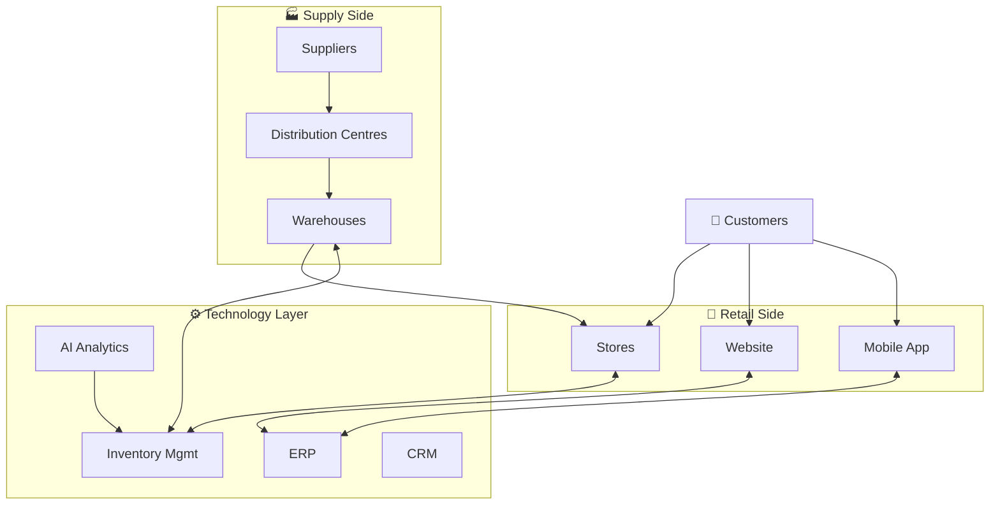
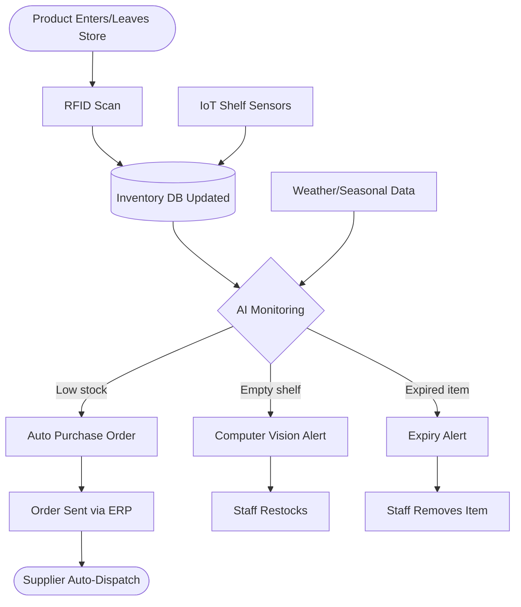

Digital Business Systems Analysis — Wal-Mart Inc.
---

## 1. Introduction

Digital technologies have revolutionized retail, now creating integrated systems that combine information, technology and communication, replacing manual methods. Business Information Systems (BIS) which include TPS, MIS, DSS, ERP, and CRM are crucial for retailers to handle the vast amount of data that is generated on a daily basis from sales, stock, and online orders.

Digital systems play a critical role in Walmart's operations, supporting inventory management, logistics, supply chain and customer data systems, which is a global retail giant. However, despite the investment in AI, cloud, big data and IoT, Walmart continues to experience inventory issues, including overstocking, stockouts, expiring products and manual checking of stock. This report begins with an analysis of Walmart's digital ecosystem, its application of information in decision making, its BIS, and introduces the AI based Smart Inventory Management System.

## 2. Organisation Overview

Walmart was established in 1962 by Sam Walton in the USA state of Arkansas and currently is a multinational retail corporation that runs a chain of supermarkets, hypermarkets, discount retailers, and a large online marketplace. The company has a B2C model that relies on retail sales, ecommerce, grocery delivery, marketplace fees, Walmart+ membership, and advertising — all backed by its Everyday Low Prices strategy and robust supply chain integration.

## 3. Digital Business Ecosystem

The technology layer (ERP, CRM, AI, cloud, inventory systems) connects suppliers, distribution centres, retail stores, digital platforms and customers in Walmart's ecosystem. Orders are processed and updated instantly throughout the inventory databases, warehouses, and reporting in management.

## 4. Problem Statement

With a vast number of stores, inventory management is challenging due to the variety of products, seasonal demand and the scale of the supply chain. The main problem areas are: Overstocking (storage costs, waste), stock shortages (lost sales), expiring products (financial/trust loss), manual checking (errors, inefficiency).

## 5. Information & Decision-Making

The DIKW model demonstrates the progression of raw data (such as barcode scans and transactions), through information (sales reports and alerts), to knowledge (demand patterns) to wisdom (stocking decisions and seasonal promotions). Good information must be accurate, timely, complete, consistent and reliable. TPS is used for operational decisions (restocking operations, scheduling operations); MIS/DSS is used for strategic decisions (opening new stores, investment in AI).

## 6. Business Information Systems

- **TPS**: Performs transactions on a daily basis (billing, returns, inventory updates).
Reports: Convert TPS data into reports (sales, inventory, supplier performance).
- DSS: Enables prediction, pricing and stocking decisions (e.g. forecasting the demand for umbrellas before the monsoon).
- ERP: It helps all the processes of inventory, finance, HR, supply chain, and procurement in one system.
CRM: Tracks customers to provide tailored recommendations and rewards.
E-Business Platform: Website, app, Walmart+, delivery services all linked to all core systems.

These systems continually communicate with one another — TPS to MIS, ERP to CRM and DSS to ERP — to facilitate coordinated, real-time operations.

## 7. Workflow: Smart Inventory Management (Proposed)

This means that RFID tags can be used to update stock automatically, sensors can be mounted on shelves to monitor levels, computer vision can alert staff when shelves are empty or when certain items are running out, AI can use past sales data as well as weather forecasts and events to predict what will be required and when, and when levels of stock are low, a purchase order is automatically sent to the supplier via ERP.

## 8. Strategic Advantage

Digital systems allow Wal-Mart to be competitive in pricing, retain its customers through CRM personalisation, automate manual tasks, grow and expand and run faster and more efficiently.

## 9. Challenges

Security vulnerabilities, data privacy regulations (such as GDPR), steep implementation expenses, employee training requirements, and integration with existing systems.

## 10. Recommendations

1. Improve the identification of items that need improvement.3. Enhance the identification of improvement areas.
2. Install smart shelves with the IoT technology.
3. Embrace AI Powered Demand Forecasting
4. Implement computer vision based expiry/empty shelf detection
5. Improve cyber security (MFA, monitoring)
6. Continually train employees
7. Improve supplier integration through cloud ERP.
8. Automate to minimise manual inventory processes

## 11. Conclusion

Digital Business Systems are vital to Walmart's business operations and are made up of TPS, MIS, DSS, CRM, ERP, AI, and cloud computing. Despite being a frontrunner in retail technology, Walmart still encounters inventory problems, including overstocking, stock outages, expiration, and manual inventory checks, which can be mitigated by implementing a proposed Smart Inventory Management System using RFID, IoT, Computer Vision and Predictive Analytics. This digital change provides a more efficient organization, lowers costs, and enables a long-term competitive edge.

## References

Laudon & Laudon (2023); Stair & Reynolds (2021); Turban et al. (2021); Walmart Inc. (2024) Annual Report; walmart.com; IBM (2024); Oracle (2024); SAP (2024); Microsoft (2024); Gartner (2024).
