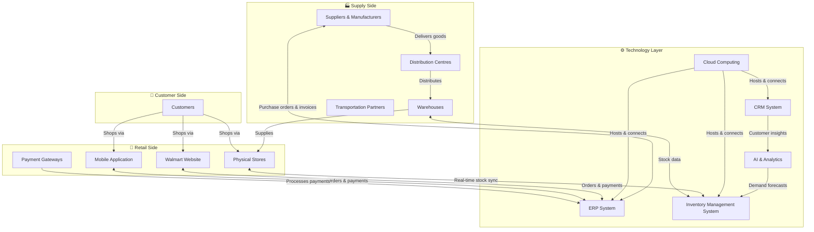
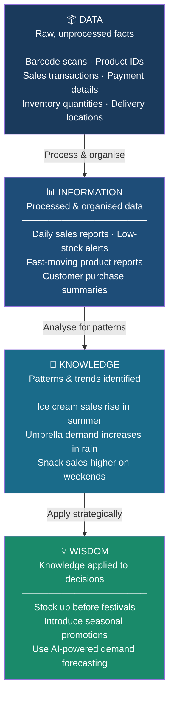
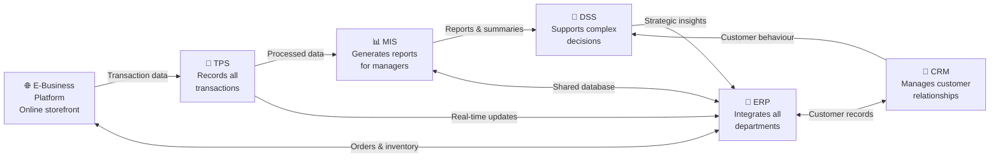
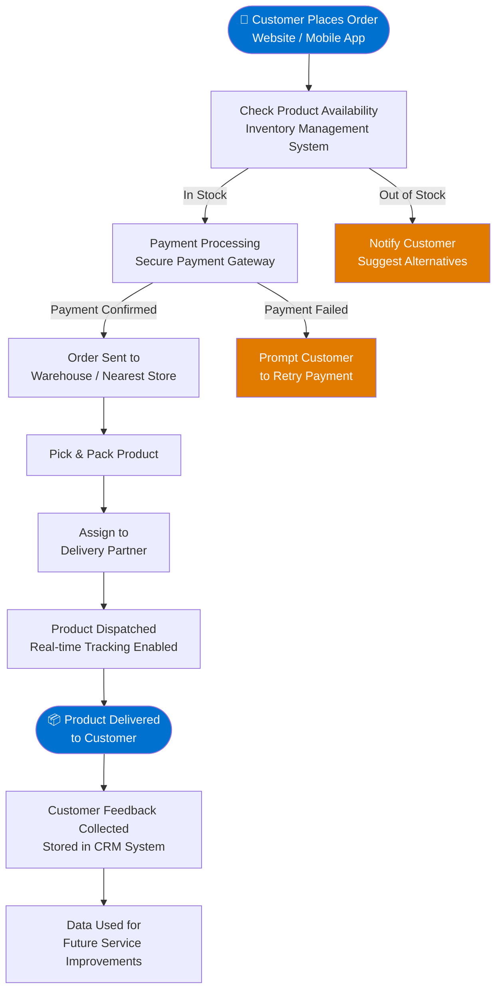
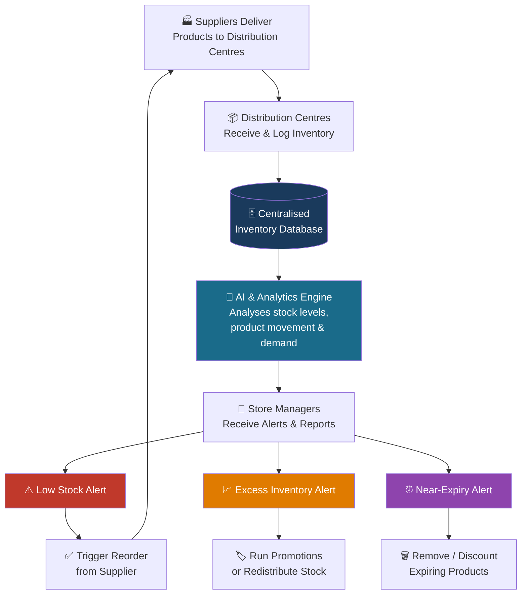
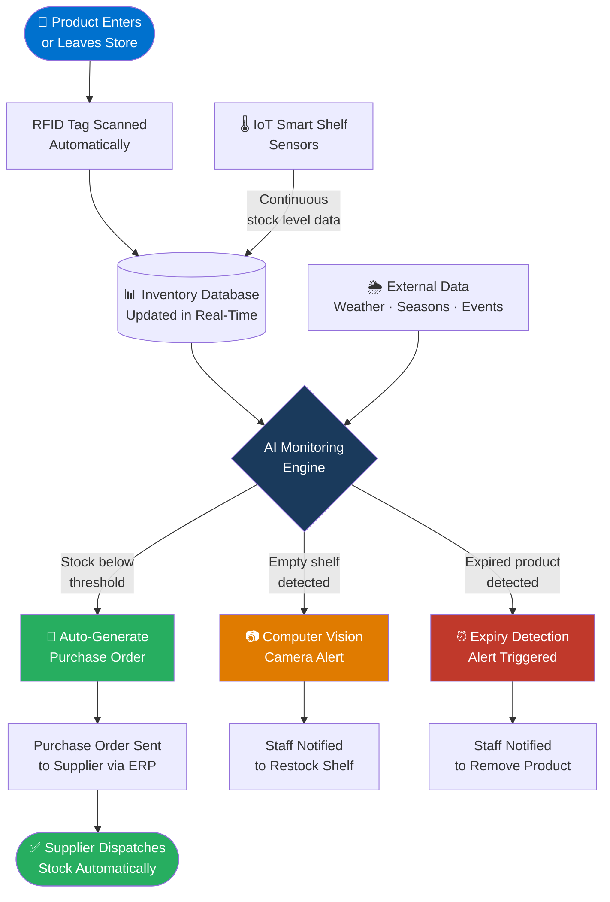

# 🛒 Digital Business Systems Analysis — Walmart Inc.

> **Course:** Digital Business Systems (ECD223-3)  
> **Institution:** CHRIST (Deemed to Be University)  
> **Assessment:** CIA 1

---

## 📋 Table of Contents

1. [Introduction](#1-introduction)
2. [Organisation Overview](#2-organisation-overview)
3. [Walmart's Digital Business Ecosystem](#3-walmarts-digital-business-ecosystem)
4. [Problem Statement](#4-problem-statement)
5. [Scope of the Study](#5-scope-of-the-study)
6. [Information and Decision-Making](#6-information-and-decision-making)
7. [Business Information Systems Analysis](#7-business-information-systems-analysis)
8. [Digital Business Workflow Analysis](#8-digital-business-workflow-analysis)
9. [Strategic Advantage Through Digital Systems](#9-strategic-advantage-through-digital-systems)
10. [Proposed Smart Inventory Management Solution](#10-proposed-smart-inventory-management-solution)
11. [Challenges](#11-challenges)
12. [Recommendations](#12-recommendations)
13. [Conclusion](#13-conclusion)
14. [References](#14-references)

---

## 1. Introduction

Digital technologies have dramatically changed the world of business in every way. Digital technologies have revolutionised the world of business in every corner of the world. In today's business environment, manual processes are no longer the primary means of running a business. Rather, they use digital business systems that combine information, technology, and communication to increase efficiency, satisfaction, and information for decisions. Digital systems allow organisations to streamline their processes, track business activities in real-time, and adapt promptly to market needs.

Especially in retail, these businesses produce vast amounts of data on a day-to-day basis as customers buy and sell items, inventory is updated, suppliers transact, and online orders are completed and payments processed. Having this much information without any automation can be a nightmare to manage. Thus, companies rely on Business Information Systems (BIS), which include Transaction Processing Systems (TPS), Management Information Systems (MIS), Decision Support Systems (DSS), Enterprise Resource Planning (ERP), and Customer Relationship Management (CRM) systems, to run the business smoothly and efficiently.

Walmart is one of the first retailers to implement advanced digital technology throughout the world. Walmart operates thousands of stores globally and has millions of customers every single day, and all of this relies heavily on digital systems to manage the company's inventory, logistics, supply chains, customer information, and financial transactions. The company is continuously working on automation, artificial intelligence (AI), cloud computing, big data analytics, and Internet of Things (IoT) so as to ensure operational efficiency and competitive advantage.

Even with these innovations, Walmart still struggles with inventory control issues at the scale of its business. Some of the challenges that continue to impact profitability and customer satisfaction include overstocking, running out of stock, product expiration, and manual stock checking. The challenges show how there is still a way to go until digital business solutions are smarter.

The report discusses the current digital business systems of Walmart, the role of information in decision-making, the relationship between different information systems, and an AI-based smart inventory management system to enhance efficiency, minimise waste, and boost business performance.

---

## 2. Organisation Overview

### Company Background

Walmart Inc. is one of the world's biggest multinational retail businesses. It was founded in 1962 by Sam Walton to offer good-quality products at fair prices to its customers. In the past few decades, Walmart has grown from a discount store in the state of Arkansas, USA, to a multinational retail corporation with a presence in thousands of stores across several countries. Nowadays, Walmart has supermarkets, hypermarkets, discount stores, warehouse clubs, and one of the biggest e-commerce websites in the world.

The company's innovative supply chain, sophisticated inventory management tools, and ongoing investment in technology are among the factors contributing to Walmart's success. The organisation is committed to using technology as a tool to make things easier, better, and keep them moving forward in the very competitive retail sector.

### Basic Company Information

| Particular | Details |
|---|---|
| **Company Name** | Walmart Inc. |
| **Founder** | Sam Walton |
| **Year Established** | 1962 |
| **Headquarters** | Bentonville, Arkansas, USA |
| **Industry** | Retail |
| **Business Type** | Multinational Retail Corporation |
| **Business Model** | Business-to-Consumer (B2C) |
| **Main Products** | Groceries, Electronics, Clothing, Household Items, Pharmacy, General Merchandise |
| **Global Presence** | Thousands of stores across multiple countries |

### Nature of Business

Walmart is a retail business that sells numerous products to consumers. Its business is directed towards providing products at a competitive price with high operational efficiency. By selling both in-store and using their mobile app and website, Walmart can seamlessly combine both brick-and-mortar and online retailing into a single business platform. The company buys goods from manufacturers/suppliers in quantity, keeps them in distribution centres, and supplies them to retailers in an efficient manner. Advanced digital systems are used to track inventory, understand customer demand, and manage product flow throughout the supply chain.

### Business Model

Walmart's main business-to-consumer (B2C) model makes it the company that sells directly to customers. Beyond brick-and-mortar locations, Walmart has built several effective digital businesses: Walmart.com, the Walmart mobile app, and Walmart+.

**Revenue is generated through:**
- Sales from retail stores
- Online shopping platform
- Grocery delivery services
- Commission for the marketplace for third-party sellers
- Walmart+ subscription services
- Advertising on digital platforms

Walmart's business strategy is **Everyday Low Prices (EDLP)**, supported by efficient inventory management and supply chain optimisation.

---

## 3. Walmart's Digital Business Ecosystem

The digital business ecosystem is composed of various actors, technologies, information systems, and digital platforms that are linked together to provide customer value.

**Walmart's ecosystem includes:**

| Layer | Components |
|---|---|
| **Supply Side** | Suppliers & manufacturers, Distribution centres, Warehouses, Transportation partners |
| **Retail Side** | Physical retail stores, Walmart website, Walmart mobile application |
| **Customer Side** | Customers, Payment gateways |
| **Technology Layer** | Cloud computing, AI systems, Inventory Management Systems, ERP, CRM |

They exchange information in real time. A customer's order is immediately processed, inventory databases are updated, which automatically sends an order to the warehouse and supplier. Concurrently, management receives reports that can predict future needs and control stock levels.

### Figure 1: Walmart Digital Business Ecosystem



---

## 4. Problem Statement

While Walmart has heavily invested in technologies that enable it to keep track of inventory, it still presents a challenge to maintain inventory across thousands of stores. Due to the vast array of products, changing customer needs, seasonal sales, and a large-scale supply chain, it is hard to have the right quantity of products in stock at all times.

### Key Inventory Challenges

| Problem | Description | Impact |
|---|---|---|
| **Overstocking** | Products left unsold for extended periods | Increased storage costs, product wastage (especially perishables) |
| **Stock Shortages** | Fast-moving items running out | Lost sales, customer dissatisfaction, reduced brand loyalty |
| **Expired Products** | Items kept past expiry due to incorrect records or delayed manual checks | Financial losses, reduced customer trust |
| **Manual Stock Checking** | Labour-intensive, time-consuming shelf inspections | Human error, incorrect records, inefficient replenishment |

### Report Objectives

- To learn about Walmart's digital business ecosystem and business model
- To examine how information is used in making decisions within Walmart
- To explore the concept and importance of Business Information Systems (BIS), including TPS, MIS, DSS, ERP and CRM
- To assess Walmart's inventory management problems
- To suggest a smart digital inventory management solution with the use of emerging technologies
- To analyse how digital systems provide Walmart with a strategic competitive advantage

---

## 5. Scope of the Study

The purpose of this report is to examine Walmart's digital business activities — specifically inventory management and information systems' impact on business performance. The study examines how different digital systems interact with each other, analyses the flow of information within the organisation, and offers technical solutions to inventory management problems. Data and information used in the report were derived from publicly released data, academic publications, and digital business concepts presented in the Digital Business Systems course.

---

## 6. Information and Decision-Making

Information is a key asset at Walmart. Millions of transactions take place in its stores, websites, and mobile applications each day. These transactions create vast amounts of data that enable Walmart to gain insights into customer behaviour, manage stock, streamline supply chains, and make insightful decisions for the business.

### 6.1 The DIKW Model

The DIKW model explains how raw data is transformed into meaningful knowledge that assists business decision-making.



### 6.2 Types of Data Generated by Walmart

| Type of Data | Examples |
|---|---|
| **Customer Data** | Name, address, purchase history, preferences |
| **Sales Data** | Daily sales, product quantity sold, revenue |
| **Inventory Data** | Stock levels, warehouse inventory, shelf availability |
| **Supplier Data** | Purchase orders, delivery schedules, invoices |
| **Financial Data** | Payments, refunds, profits, expenses |
| **Employee Data** | Attendance, work schedules, payroll |
| **Logistics Data** | Delivery routes, shipment tracking |
| **Marketing Data** | Customer responses to promotions and advertisements |

### 6.3 Information Quality and Decision-Making

Inaccurate data can result in mis-stocking, delays, unmet customer expectations, and revenue losses. The characteristics of good information are:

| Characteristic | Description |
|---|---|
| **Accuracy** | Information should not contain errors — improper inventory data leads to under- or overstock |
| **Timeliness** | Managers require up-to-date information; real-time updates enable immediate restocking |
| **Completeness** | Insufficient information leads to sub-optimal forecasting and purchasing decisions |
| **Consistency** | Information must be consistent across stores, online platforms, and warehouses |
| **Reliability** | Managers need to be confident in the information upon which they base decisions |

### 6.4 Operational vs. Strategic Decision-Making

| Type | Description | Examples | System Used |
|---|---|---|---|
| **Operational** | Day-to-day business activities | Restocking shelves, scheduling deliveries, updating inventory, scheduling shifts, removing expired products | TPS |
| **Strategic** | Long-term planning and business growth | Opening new stores, entering new markets, investing in AI, selecting suppliers, sustainability initiatives | MIS & DSS |

---

## 7. Business Information Systems Analysis

Walmart employs various Business Information Systems that are interconnected and operate in harmony to aid everyday functioning and long-term business plans.

### 7.1 Transaction Processing System (TPS)

A TPS accurately and efficiently records and processes routine transactional business functions.

**At Walmart, TPS handles:**
- Barcode scanning at the cashier
- Customer billing and payment processing
- Product returns
- Inventory updates
- Online order processing

Each time a customer buys an item, the TPS automatically removes the product from stock and provides instant updates to the central database.

**Benefits:** Faster transactions · Reduced human error · Accurate inventory records · Improved customer service · Real-time data collection

---

### 7.2 Management Information System (MIS)

MIS gathers data from TPS and produces structured reports that help management track business performance.

**Examples of MIS reports at Walmart:**
- Daily sales reports
- Monthly revenue reports
- Inventory reports
- Employee productivity reports
- Supplier performance reports

**Benefits:** Better monitoring · Improved planning · Faster reporting · Increased efficiency · Better resource allocation

---

### 7.3 Decision Support System (DSS)

A DSS helps managers analyse large quantities of data to make decisions on business problems.

**In Walmart, DSS assists managers to:**
- Forecast customer demand
- Predict seasonal sales
- Determine optimal stocking levels
- Analyse pricing strategies
- Evaluate supplier performance
- Identify high-performing products

> *Example: If sales history shows umbrella demand rises before the rainy season, DSS recommends increasing inventory of those items.*

**Benefits:** Improved forecasting · Better planning · Faster decision-making · Reduced inventory waste · Increased profitability

---

### 7.4 Enterprise Resource Planning (ERP)

ERP connects different areas of business into one unified system.

**At Walmart, ERP integrates:**

```
Inventory Management  ←→  Finance  ←→  Human Resources
        ↕                                      ↕
 Supply Chain Mgmt   ←→  Procurement  ←→  Warehouse Mgmt
```

This integration allows smooth transfer of information between departments, eliminating redundant data entry and enhancing collaboration.

**Benefits:** Improved collaboration · Centralised database · Better communication · Faster reporting · Reduced operational costs

---

### 7.5 Customer Relationship Management (CRM)

Walmart uses CRM to understand customers' preferences and increase satisfaction.

**CRM data includes:**
- Purchase history
- Shopping preferences
- Loyalty program details
- Customer complaints
- Product reviews

This data is leveraged for personalised recommendations, targeted promotions, and enhanced customer service.

---

### 7.6 E-Business Platform

Walmart has built a solid e-business platform allowing users to purchase products online seamlessly.

**Digital platform components:**
- Walmart website (Walmart.com)
- Mobile application
- Walmart+ subscription
- Online grocery delivery
- Digital payment gateways
- Order tracking
- Click-and-collect services

The e-business platform is connected with TPS, ERP, CRM, and inventory management systems to deliver a seamless shopping experience.

---

### 7.7 Interaction Between Business Information Systems

Although each information system performs a different function, they are interconnected and continuously exchange information.



This interaction ensures that information flows efficiently throughout the organisation, enabling Walmart to respond quickly to changes in customer demand while maintaining operational efficiency.

---

## 8. Digital Business Workflow Analysis

Business workflows describe how information, materials, and activities move through an organisation to complete a business process. Walmart uses integrated digital systems to ensure that inventory, orders, payments, and customer services operate efficiently.

### Figure 2: Order Placement to Delivery Workflow



**Explanation:** When a customer places an order through Walmart's website or mobile application, the system first checks product availability using the Inventory Management System. Once availability is confirmed, the payment is processed through a secure payment gateway. The warehouse or nearest store receives the order, picks the product, packs it, and assigns it to a delivery partner. After delivery, customer feedback is collected and stored in the CRM system for future service improvements.

---

### Figure 3: Inventory Management Data Flow Diagram



**Explanation:** Suppliers deliver products to Walmart's distribution centres, where inventory information is stored in a centralised database. AI and analytics systems continuously analyse stock levels, product movement, and demand patterns. Managers receive alerts about low stock, excess inventory, or products nearing expiry, allowing them to make informed decisions.

---

### Figure 4: Proposed Smart Inventory Management Workflow



**Explanation:** This proposed workflow introduces automation into Walmart's inventory management system. RFID technology updates inventory automatically whenever products enter or leave the store. AI monitors stock levels continuously, while computer vision cameras detect empty shelves and expired products. IoT sensors on smart shelves feed real-time data into the central database. If inventory falls below a predefined level, the system automatically generates a purchase order and sends it to suppliers via ERP — reducing manual work and preventing stock shortages.

---

## 9. Strategic Advantage Through Digital Systems

Walmart has several strategic advantages from digital technologies that aid it in retaining its status as one of the world's largest retailers.

| Strategic Area | How Walmart Benefits |
|---|---|
| **Competitive Advantage** | Digital systems enable competitive pricing and operational efficiency. Data-driven tracking and replenishment decrease costs and enhance product availability. |
| **Customer Retention** | CRM systems allow Walmart to study purchasing patterns and provide individualised suggestions, loyalty initiatives, and targeted promotions — boosting repeat sales. |
| **Automation** | Automation minimises manual effort in stock maintenance, transaction processing, report generation, and supply chain management — freeing staff to focus on customer service. |
| **Scalability** | Integrated enterprise systems allow Walmart to expand — opening new stores or entering new markets — without greatly increasing operational complexity. |
| **Personalisation** | AI analyses customer preferences and purchases to suggest the right products and tailored offers, enhancing the shopping experience and boosting sales. |
| **Operational Efficiency** | Real-time information enables quicker decision-making, fewer delays, lower inventory costs, and better coordination between suppliers, stores, warehouses, and customers. |

---

## 10. Proposed Smart Inventory Management Solution

Even though Walmart already utilises advanced stock management systems, it can go further by combining AI, IoT, RFID, and Computer Vision into a unified Smart Inventory Management System.

### RFID Technology

An RFID tag attached to each product automatically updates inventory records when the product enters or leaves a warehouse or store. Unlike conventional barcode scanning, RFID scans multiple products simultaneously.

✅ Faster inventory tracking · Reduced manual scanning · Improved accuracy · Lower labour costs

---

### Internet of Things (IoT) Smart Shelf Sensors

IoT-based smart shelves constantly monitor stock levels and trigger alerts when stock runs low — providing real-time inventory insights without manual employee inspections.

✅ Real-time stock monitoring · Reduced stock shortages · Improved inventory visibility · Faster replenishment

---

### Computer Vision

AI cameras placed around the store automatically detect empty shelves, misplaced items, and out-of-date food products.

✅ Automatic expiry identification · Reduced food waste · Improved product quality · Enhanced customer safety

---

### AI and Predictive Analytics

Machine learning algorithms leverage historical sales data, weather predictions, seasonal patterns, and local events to forecast future product demand.

**Examples:**
- Increased beverage demand during summer
- Higher toy sales over Christmas
- Greater food shopping activity before festivals

✅ Better demand forecasting · Reduced excess inventory · Lower storage costs · Increased customer satisfaction

---

### Automatic Reordering System

When inventory falls below a predefined threshold, the system automatically generates a purchase order and submits it to the supplier via the ERP system.

✅ Faster replenishment · Reduced manual intervention · Improved supplier coordination · Reduced out-of-stock risk

---

## 11. Challenges

| Challenge | Description |
|---|---|
| **Cybersecurity** | Large databases storing customer and financial data are prime targets for cybercriminals. Robust encryption, firewalls, and continuous surveillance are essential. |
| **Data Privacy** | Walmart holds vast amounts of customer data. Compliance with GDPR and other data protection laws is a critical responsibility. |
| **High Implementation Cost** | Adopting AI, IoT, RFID, and Computer Vision involves significant investment — particularly challenging for smaller retail organisations. |
| **Employee Training** | Workers must be trained to use new digital systems effectively. Without proper training, the full benefits of advanced technology cannot be realised. |
| **System Integration** | Integrating new technologies with existing enterprise systems is complex and requires significant technical expertise. |

---

## 12. Recommendations

Based on this analysis, the following recommendations are proposed to enhance Walmart's inventory management system:

1. ✅ Increase the use of RFID technology across all products
2. ✅ Deploy smart shelves with IoT sensors for automated inventory management
3. ✅ Adopt AI-driven demand forecasting with predictive analytics
4. ✅ Implement computer vision systems to automatically detect expired products and empty shelves
5. ✅ Implement multi-factor authentication and ongoing monitoring to enhance cybersecurity
6. ✅ Offer ongoing training on emerging digital technologies for all employees
7. ✅ Enhance supplier integration with cloud ERP solutions
8. ✅ Implement greater automation to minimise manual inventory management

These recommendations will help Walmart cut down on waste, optimise operational efficiency, improve customer satisfaction, and strengthen competitive advantage.

---

## 13. Conclusion

In the current competitive business landscape, Digital Business Systems are essential for all organisations. Walmart's ERP systems can integrate with advanced technologies like TPS, MIS, DSS, CRM, Artificial Intelligence, and cloud computing — enabling efficient business operations and enhancing organisational performance.

This report studied Walmart's digital business ecosystem, analysed how information is used in decision-making, and examined the relationships among business information systems. It identified key inventory management issues — overstocking, stock shortages, expired products, and manual inventory monitoring — and proposed a **Smart Inventory Management System** incorporating RFID, IoT, Computer Vision, Artificial Intelligence, and Predictive Analytics as the solution.

Digital transformation is not just enhancing Walmart's operational efficiency — it is providing a long-term strategic advantage by improving customer service, reducing operational costs, bolstering automation, and fostering sustainable business growth. As technology continues to evolve, companies like Walmart must constantly adapt their digital systems to stay ahead in the retail market.

---

## 14. References

- Laudon, K. C., & Laudon, J. P. (2023). *Management Information Systems: Managing the Digital Firm* (17th ed.). Pearson.
- Stair, R., & Reynolds, G. (2021). *Principles of Information Systems* (14th ed.). Cengage Learning.
- Turban, E., Pollard, C., & Wood, G. (2021). *Information Technology for Management* (12th ed.). Wiley.
- Walmart Inc. (2024). *Annual Report 2024*. https://stock.walmart.com
- Walmart. (2024). https://www.walmart.com
- IBM. (2024). *What is Artificial Intelligence?* https://www.ibm.com
- Oracle. (2024). *Enterprise Resource Planning (ERP)*. https://www.oracle.com
- SAP. (2024). *Inventory Management Solutions*. https://www.sap.com
- Microsoft. (2024). *Cloud Computing Solutions*. https://www.microsoft.com
- Gartner. (2024). *Digital Business Research*. https://www.gartner.com
