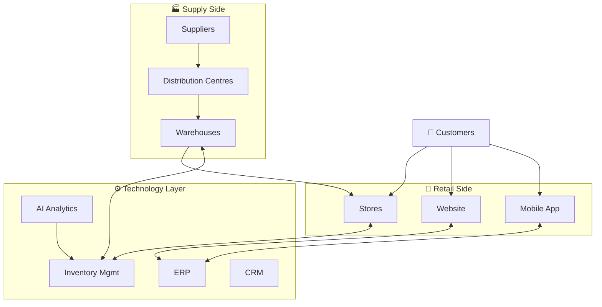
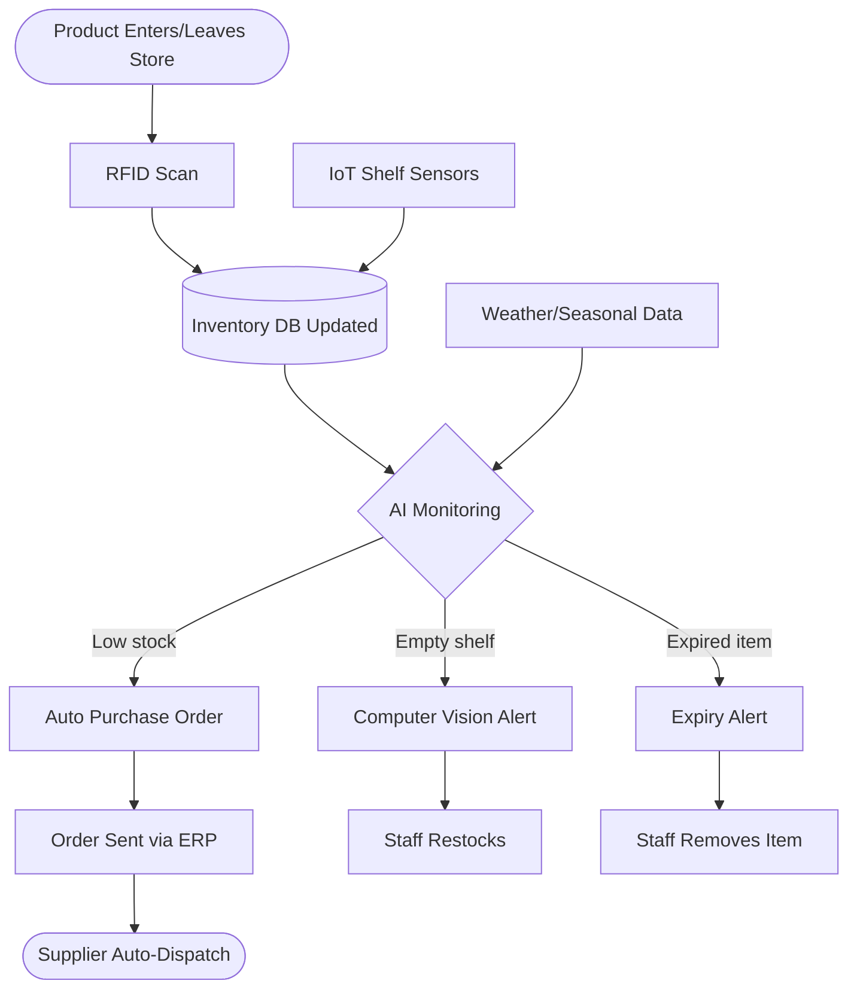
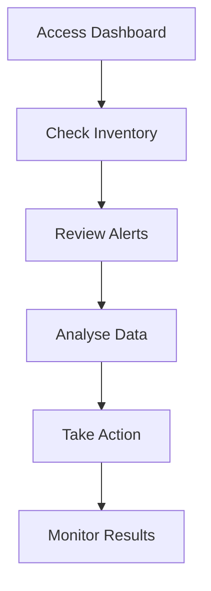

**REDEFINING RETAIL**

**Smarter Stock. Smarter Retail.**

Eeshani Srivastava

Raibat Roy Choudhury

Shrinjini Samanta

Sujishnu Bhattacharya

Thiruharan Keshavan Pillai

## 1. Introduction

Digital technologies have revolutionized retail, now creating integrated systems that combine information, technology and communication, replacing manual methods. Business Information Systems (BIS) which include TPS, MIS, DSS, ERP, and CRM are crucial for retailers to handle the vast amount of data that is generated on a daily basis from sales, stock, and online orders. 

Digital systems play a critical role in Walmart's operations, supporting inventory management, logistics, supply chain and customer data systems, which is a global retail giant. However, despite the investment in AI, cloud, big data and IoT, Walmart continues to experience inventory issues, including overstocking, stockouts, expiring products and manual checking of stock. This report begins with an analysis of Walmart's digital ecosystem, its application of information in decision making, its BIS, and introduces the AI based Smart Inventory Management System.

## 2. Organisation Overview

Walmart was established in 1962 by Sam Walton in the USA state of Arkansas and currently is a multinational retail corporation that runs a chain of supermarkets, hypermarkets, discount retailers, and a large online marketplace. The company has a B2C model that relies on retail sales, ecommerce, grocery delivery, marketplace fees, Walmart+ membership, and advertising — all backed by its Everyday Low Prices strategy and robust supply chain integration.

## 3. Digital Business Ecosystem

The technology layer (ERP, CRM, AI, cloud, inventory systems) connects suppliers, distribution centres, retail stores, digital platforms and customers in Walmart's ecosystem. Orders are processed and updated instantly throughout the inventory databases, warehouses, and reporting in management.

```mermaid
graph TD
    subgraph SUPPLY["🏭 Supply Side"]
        S1[Suppliers] --> S2[Distribution Centres] --> S3[Warehouses]
    end
    subgraph TECH["⚙️ Technology Layer"]
        T1[ERP] & T2[Inventory Mgmt] & T3[AI Analytics] & T4[CRM]
    end
    subgraph RETAIL["🏪 Retail Side"]
        R1[Stores] & R2[Website] & R3[Mobile App]
    end
    C1[👤 Customers]
    S3 --> R1
    T2 <--> S3
    T3 --> T2
    R1 <--> T2
    R2 & R3 <--> T1
    C1 --> R1 & R2 & R3
```

## 4. Problem Statement

With a vast number of stores, inventory management is challenging due to the variety of products, seasonal demand and the scale of the supply chain. The main problem areas are: Overstocking (storage costs, waste), stock shortages (lost sales), expiring products (financial/trust loss), manual checking (errors, inefficiency).

## 5. Workflow: Smart Inventory Management 

```mermaid
flowchart TD
    A([Product Enters/Leaves Store]) --> B[RFID Scan]
    B --> C[(Inventory DB Updated)]
    C --> D{AI Monitoring}
    D -->|Low stock| E[Auto Purchase Order]
    D -->|Empty shelf| F[Computer Vision Alert]
    D -->|Expired item| G[Expiry Alert]
    E --> H[Order Sent via ERP]
    F --> I[Staff Restocks]
    G --> J[Staff Removes Item]
    K[IoT Shelf Sensors] --> C
    L[Weather/Seasonal Data] --> D
    H --> M([Supplier Auto-Dispatch])
```

This means that RFID tags can be used to update stock automatically, sensors can be mounted on shelves to monitor levels, computer vision can alert staff when shelves are empty or when certain items are running out, AI can use past sales data as well as weather forecasts and events to predict what will be required and when, and when levels of stock are low, a purchase order is automatically sent to the supplier via ERP.

<h2>📖 How to Use Redefining Retail</h2>

<table>
<tr>
<td width="700">

<strong>Step 1: Access the System</strong> 
Open the Redefining Retail application and access the main dashboard to view the current inventory status and key stock information.

 

<strong>Step 2: Monitor Inventory</strong> 
Use the inventory section to check available products, stock quantities, low-stock items, and products that require attention.

 

<strong>Step 3: Review Alerts</strong> 
Check alerts for low or out-of-stock products, expiring or expired products, items requiring restocking, and unusual inventory changes.

 

<strong>Step 4: Analyse Stock Information</strong> 
Use the dashboard and reports to review sales, inventory levels, and product performance to identify demand patterns, shortages, or overstocking.

 

<strong>Step 5: Take Action</strong> 
Restock products, remove expired items, or initiate purchase orders based on the alerts and insights provided.

 

<strong>Step 6: Use Predictive Insights</strong> 
Use AI-based predictions and historical sales data to anticipate demand and make better stocking decisions.

 

<strong>Step 7: Maintain Accurate Data</strong> 
Regularly update inventory and transaction information to ensure accurate reports, alerts, and recommendations.

</td>
</tr>
</table>

**Quick Workflow**

```mermaid
flowchart TD
    A[Access Dashboard] --> B[Check Inventory]
    B --> C[Review Alerts]
    C --> D[Analyse Data]
    D --> E[Take Action]
    E --> F[Monitor Results]
```

The system is intended to reduce manual inventory checking, minimise stockouts and overstocking, and support faster, data-driven retail decisions.

## 6. Conclusion

Digital Business Systems are vital to Walmart's business operations and are made up of TPS, MIS, DSS, CRM, ERP, AI, and cloud computing. Despite being a frontrunner in retail technology, Walmart still encounters inventory problems, including overstocking, stock outages, expiration, and manual inventory checks, which can be mitigated by implementing a proposed Smart Inventory Management System using RFID, IoT, Computer Vision and Predictive Analytics. This digital change provides a more efficient organization, lowers costs, and enables a long-term competitive edge.

## References

Laudon & Laudon (2023); Stair & Reynolds (2021); Turban et al. (2021); Walmart Inc. (2024) Annual Report; walmart.com; IBM (2024); Oracle (2024); SAP (2024); Microsoft (2024); Gartner (2024).
